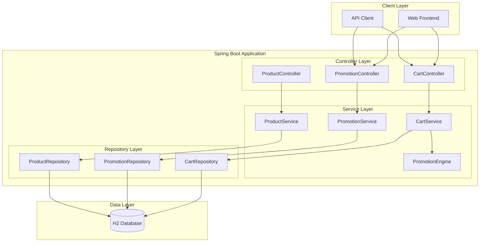
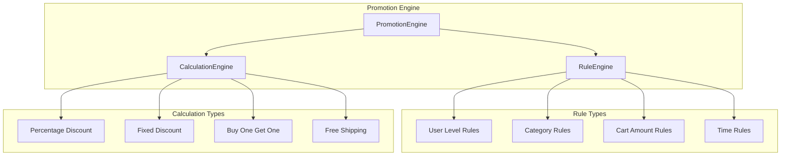

# 🏗️ 장바구니 프로모션 시스템 설계 문서

## 📋 목차
1. [시스템 개요](#1-시스템-개요)
2. [아키텍처 설계](#2-아키텍처-설계)
3. [데이터 모델 설계](#3-데이터-모델-설계)
4. [API 설계](#4-api-설계)
5. [프로모션 엔진 설계](#5-프로모션-엔진-설계)
6. [구현 계획](#6-구현-계획)
7. [테스트 전략](#7-테스트-전략)

---

## 1. 시스템 개요

### 1.1 목적
현재 Spring Boot 모놀리식 프로젝트에 장바구니 프로모션 기능을 추가하여 복수의 할인 정책을 자동 적용하는 시스템

### 1.2 핵심 기능
- **프로모션 정책 관리**: 다양한 할인 정책의 생성, 수정, 삭제
- **실시간 가격 계산**: 장바구니 상품에 대한 즉시 할인 적용
- **우선순위 처리**: 복잡한 할인 규칙의 우선순위 관리
- **중복 방지**: 상호 배타적인 할인 정책 처리
- **사용자 맞춤**: 사용자 등급, 결제 수단별 차별화된 할인

### 1.3 기술 스택
- **Backend**: Spring Boot 3.5.5, Kotlin 1.9.25
- **Database**: H2 (개발/테스트)
- **Build Tool**: Gradle
- **Java Version**: 21
- **Architecture**: 모놀리식 (Monolithic)

---

## 2. 아키텍처 설계

### 2.1 전체 아키텍처



### 2.2 패키지 구조

```
com.example.demo/
├── cart/                    # 장바구니 관련
│   ├── CartController.kt
│   ├── CartService.kt
│   ├── CartRepository.kt
│   └── dto/
├── product/                 # 상품 관련 (기존)
│   ├── ProductController.kt
│   ├── ProductService.kt
│   ├── ProductRepository.kt
│   └── dto/
├── promotion/               # 프로모션 관련 (신규)
│   ├── PromotionController.kt
│   ├── PromotionService.kt
│   ├── PromotionRepository.kt
│   ├── PromotionEngine.kt
│   ├── engine/
│   │   ├── RuleEngine.kt
│   │   └── CalculationEngine.kt
│   └── dto/
├── user/                    # 사용자 관련 (신규)
│   ├── UserController.kt
│   ├── UserService.kt
│   ├── UserRepository.kt
│   └── dto/
└── config/                  # 설정 관련
    └── PromotionConfig.kt
```

### 2.3 레이어별 책임

| 레이어 | 주요 책임 |
|--------|-----------|
| **Controller** | HTTP 요청/응답 처리, 입력 검증 |
| **Service** | 비즈니스 로직 처리, 트랜잭션 관리 |
| **Repository** | 데이터 접근, JPA 쿼리 처리 |
| **Engine** | 프로모션 규칙 처리, 가격 계산 |

---

## 3. 데이터 모델 설계

### 3.1 핵심 엔티티

#### 3.1.1 Promotion (프로모션)
```kotlin
@Entity
@Table(name = "promotions")
data class Promotion(
    @Id
    @GeneratedValue(strategy = GenerationType.IDENTITY)
    val id: Long? = null,
    
    @Column(nullable = false, length = 100)
    val name: String,
    
    @Column(length = 500)
    val description: String? = null,
    
    @Enumerated(EnumType.STRING)
    @Column(nullable = false)
    val type: PromotionType,
    
    @Column(nullable = false)
    val priority: Int,
    
    @Column(nullable = false)
    val isActive: Boolean = true,
    
    @Column(nullable = false)
    val startDate: LocalDateTime,
    
    @Column(nullable = false)
    val endDate: LocalDateTime,
    
    // 단순화된 조건 필드들
    @Column(length = 50)
    val targetCategory: String? = null,
    
    @Column
    val minCartAmount: BigDecimal? = null,
    
    @Column
    val minQuantity: Int? = null,
    
    @Enumerated(EnumType.STRING)
    val targetUserLevel: MembershipLevel? = null,
    
    // 혜택 필드들
    @Column(precision = 5, scale = 2)
    val discountPercentage: BigDecimal? = null,
    
    @Column(precision = 10, scale = 2)
    val discountAmount: BigDecimal? = null,
    
    @Column(precision = 10, scale = 2)
    val maxDiscountAmount: BigDecimal? = null,
    
    @Column(nullable = false)
    val createdAt: LocalDateTime = LocalDateTime.now(),
    
    @Column(nullable = false)
    val updatedAt: LocalDateTime = LocalDateTime.now()
)
```

#### 3.1.2 User (사용자) - 단순화
```kotlin
@Entity
@Table(name = "users")
data class User(
    @Id
    @GeneratedValue(strategy = GenerationType.IDENTITY)
    val id: Long? = null,
    
    @Column(nullable = false, length = 100)
    val email: String,
    
    @Enumerated(EnumType.STRING)
    @Column(nullable = false)
    val membershipLevel: MembershipLevel = MembershipLevel.REGULAR,
    
    @Column(nullable = false)
    val isNewCustomer: Boolean = true,
    
    @Column(nullable = false)
    val createdAt: LocalDateTime = LocalDateTime.now()
)
```

#### 3.1.3 CartItem (장바구니 아이템) - 기존 CartService 확장
```kotlin
@Entity
@Table(name = "cart_items")
data class CartItem(
    @Id
    @GeneratedValue(strategy = GenerationType.IDENTITY)
    val id: Long? = null,
    
    @Column(nullable = false)
    val userId: Long,
    
    @Column(nullable = false)
    val productId: Long,
    
    @Column(nullable = false)
    val quantity: Int,
    
    @Column(nullable = false, precision = 10, scale = 2)
    val unitPrice: BigDecimal,
    
    @Column(nullable = false, precision = 10, scale = 2)
    val totalPrice: BigDecimal,
    
    @Column(nullable = false)
    val createdAt: LocalDateTime = LocalDateTime.now()
)
```

### 3.2 열거형 타입

```kotlin
enum class PromotionType {
    PERCENTAGE_DISCOUNT,    // 퍼센트 할인
    FIXED_DISCOUNT,         // 고정 금액 할인
    BUY_ONE_GET_ONE,        // 1+1 행사
    FREE_SHIPPING,          // 무료 배송
    CASHBACK                // 캐시백
}

enum class MembershipLevel {
    NEW,                    // 신규 고객
    REGULAR,                // 일반 고객
    VIP,                    // VIP 고객
    PREMIUM                 // 프리미엄 고객
}
```

### 3.3 기존 Product 엔티티 활용
현재 프로젝트의 `Product` 엔티티를 그대로 활용하여 카테고리, 브랜드 정보를 프로모션 조건으로 사용합니다.

---

## 4. API 설계

### 4.1 장바구니 관련 API (기존 확장)

#### 4.1.1 장바구니 가격 계산 (프로모션 적용)
```http
POST /api/cart/calculate-with-promotions
Content-Type: application/json

{
  "userId": 123,
  "items": [
    {
      "productId": 1,
      "quantity": 2
    },
    {
      "productId": 2,
      "quantity": 1
    }
  ]
}
```

**응답:**
```json
{
  "items": [
    {
      "productId": 1,
      "productName": "상품 A",
      "unitPrice": 50000,
      "quantity": 2,
      "totalPrice": 100000,
      "appliedPromotions": [
        {
          "promotionId": 1,
          "promotionName": "VIP 5% 할인",
          "discountAmount": 5000
        }
      ]
    }
  ],
  "subtotal": 100000,
  "totalDiscount": 5000,
  "shippingFee": 0,
  "finalAmount": 95000,
  "appliedPromotions": [
    {
      "promotionId": 1,
      "promotionName": "VIP 5% 할인",
      "discountAmount": 5000
    },
    {
      "promotionId": 2,
      "promotionName": "무료 배송",
      "discountAmount": 3000
    }
  ]
}
```

### 4.2 프로모션 관리 API

#### 4.2.1 프로모션 생성
```http
POST /api/promotions
Content-Type: application/json

{
  "name": "VIP 회원 5% 할인",
  "description": "VIP 회원 대상 5% 할인",
  "type": "PERCENTAGE_DISCOUNT",
  "priority": 3,
  "startDate": "2024-01-01T00:00:00",
  "endDate": "2024-12-31T23:59:59",
  "targetUserLevel": "VIP",
  "minCartAmount": 50000,
  "discountPercentage": 5.0,
  "maxDiscountAmount": 10000
}
```

#### 4.2.2 프로모션 목록 조회
```http
GET /api/promotions?active=true
```

#### 4.2.3 프로모션 상세 조회
```http
GET /api/promotions/{id}
```

#### 4.2.4 프로모션 수정
```http
PUT /api/promotions/{id}
Content-Type: application/json

{
  "name": "VIP 회원 7% 할인",
  "discountPercentage": 7.0
}
```

### 4.3 사용자 관리 API

#### 4.3.1 사용자 생성
```http
POST /api/users
Content-Type: application/json

{
  "email": "user@example.com",
  "membershipLevel": "VIP",
  "isNewCustomer": false
}
```

#### 4.3.2 사용자 조회
```http
GET /api/users/{id}
```

---

## 5. 프로모션 엔진 설계

### 5.1 프로모션 엔진 아키텍처



### 5.2 프로모션 엔진 구현

```kotlin
@Service
class PromotionEngine(
    private val promotionRepository: PromotionRepository,
    private val productRepository: ProductRepository
) {
    
    fun calculatePromotions(
        cartRequest: CartRequest,
        user: User
    ): PromotionResult {
        
        // 1. 활성 프로모션 조회
        val activePromotions = promotionRepository.findActivePromotions(
            LocalDateTime.now()
        )
        
        // 2. 장바구니 아이템 정보 조회
        val cartItems = cartRequest.items.map { itemRequest ->
            val product = productRepository.findById(itemRequest.productId)
                .orElseThrow { RuntimeException("상품을 찾을 수 없습니다: ${itemRequest.productId}") }
            CartItemInfo(product, itemRequest.quantity)
        }
        
        // 3. 적용 가능한 프로모션 필터링
        val applicablePromotions = activePromotions.filter { promotion ->
            isPromotionApplicable(promotion, cartItems, user)
        }
        
        // 4. 우선순위 정렬
        val sortedPromotions = applicablePromotions.sortedBy { it.priority }
        
        // 5. 할인 계산
        return calculateDiscounts(cartItems, sortedPromotions, user)
    }
    
    private fun isPromotionApplicable(
        promotion: Promotion,
        cartItems: List<CartItemInfo>,
        user: User
    ): Boolean {
        // 사용자 등급 확인
        if (promotion.targetUserLevel != null && user.membershipLevel != promotion.targetUserLevel) {
            return false
        }
        
        // 장바구니 금액 확인
        val totalAmount = cartItems.sumOf { it.product.price * it.quantity.toBigDecimal() }
        if (promotion.minCartAmount != null && totalAmount < promotion.minCartAmount) {
            return false
        }
        
        // 카테고리 확인
        if (promotion.targetCategory != null) {
            val hasTargetCategory = cartItems.any { it.product.category == promotion.targetCategory }
            if (!hasTargetCategory) return false
        }
        
        return true
    }
    
    private fun calculateDiscounts(
        cartItems: List<CartItemInfo>,
        promotions: List<Promotion>,
        user: User
    ): PromotionResult {
        var totalDiscount = BigDecimal.ZERO
        val appliedPromotions = mutableListOf<AppliedPromotion>()
        
        for (promotion in promotions) {
            val discount = calculatePromotionDiscount(promotion, cartItems, user)
            if (discount > BigDecimal.ZERO) {
                totalDiscount += discount
                appliedPromotions.add(AppliedPromotion(
                    promotionId = promotion.id!!,
                    promotionName = promotion.name,
                    discountAmount = discount
                ))
            }
        }
        
        val subtotal = cartItems.sumOf { it.product.price * it.quantity.toBigDecimal() }
        val finalAmount = subtotal - totalDiscount
        
        return PromotionResult(
            subtotal = subtotal,
            totalDiscount = totalDiscount,
            finalAmount = finalAmount,
            appliedPromotions = appliedPromotions
        )
    }
    
    private fun calculatePromotionDiscount(
        promotion: Promotion,
        cartItems: List<CartItemInfo>,
        user: User
    ): BigDecimal {
        val subtotal = cartItems.sumOf { it.product.price * it.quantity.toBigDecimal() }
        
        return when (promotion.type) {
            PromotionType.PERCENTAGE_DISCOUNT -> {
                val discount = subtotal * (promotion.discountPercentage!! / BigDecimal(100))
                val maxDiscount = promotion.maxDiscountAmount ?: discount
                minOf(discount, maxDiscount)
            }
            PromotionType.FIXED_DISCOUNT -> {
                minOf(promotion.discountAmount!!, subtotal)
            }
            PromotionType.FREE_SHIPPING -> {
                // 배송비는 별도 계산 (예: 3000원)
                BigDecimal(3000)
            }
            else -> BigDecimal.ZERO
        }
    }
}

data class CartItemInfo(
    val product: Product,
    val quantity: Int
)

data class AppliedPromotion(
    val promotionId: Long,
    val promotionName: String,
    val discountAmount: BigDecimal
)

data class PromotionResult(
    val subtotal: BigDecimal,
    val totalDiscount: BigDecimal,
    val finalAmount: BigDecimal,
    val appliedPromotions: List<AppliedPromotion>
)
```

---

## 6. 구현 계획

### 6.1 개발 단계

#### Phase 1: 기본 구조 (1주)
- [ ] 데이터 모델 구현 (Promotion, User, CartItem)
- [ ] Repository 레이어 구현
- [ ] 기본 Service 레이어 구현

#### Phase 2: 프로모션 엔진 (2주)
- [ ] PromotionEngine 구현
- [ ] 기본 프로모션 규칙 구현 (사용자 등급, 장바구니 금액)
- [ ] 할인 계산 로직 구현

#### Phase 3: API 구현 (1주)
- [ ] CartController 확장 (프로모션 적용 계산)
- [ ] PromotionController 구현
- [ ] UserController 구현

#### Phase 4: 테스트 및 최적화 (1주)
- [ ] 단위 테스트 작성
- [ ] 통합 테스트 작성
- [ ] 성능 테스트 및 최적화

### 6.2 구현 우선순위

1. **높음**: 기본 프로모션 엔진 (퍼센트 할인, 고정 할인)
2. **중간**: 사용자 등급별 할인, 카테고리별 할인
3. **낮음**: 복잡한 프로모션 규칙, 1+1 행사

---

## 7. 테스트 전략

### 7.1 테스트 라이브러리 설정

```kotlin
// build.gradle.kts
dependencies {
    testImplementation("io.kotest:kotest-runner-junit5:5.8.0")
    testImplementation("io.kotest:kotest-assertions-core:5.8.0")
    testImplementation("io.kotest:kotest-property:5.8.0")
    testImplementation("io.kotest:kotest-framework-datatest:5.8.0")
    testImplementation("io.mockk:mockk:1.13.8")
    testImplementation("org.jetbrains.kotlin:kotlin-test")
}
```

### 7.2 비즈니스 로직 단위 테스트

#### 7.2.1 프로모션 엔진 테스트

```kotlin
class PromotionEngineTest : FunSpec({
    
    val mockPromotionRepository = mockk<PromotionRepository>()
    val mockProductRepository = mockk<ProductRepository>()
    val promotionEngine = PromotionEngine(mockPromotionRepository, mockProductRepository)
    
    context("프로모션 할인 계산") {
        
        test("VIP 사용자에게 5% 할인이 적용되어야 한다") {
            // Given
            val user = User(
                id = 1L, 
                email = "vip@test.com", 
                membershipLevel = MembershipLevel.VIP
            )
            val product = Product(
                id = 1L, 
                name = "상품", 
                price = BigDecimal(50000), 
                category = "전자제품"
            )
            val promotion = Promotion(
                name = "VIP 할인",
                type = PromotionType.PERCENTAGE_DISCOUNT,
                targetUserLevel = MembershipLevel.VIP,
                discountPercentage = BigDecimal(5),
                priority = 1,
                isActive = true,
                startDate = LocalDateTime.now().minusDays(1),
                endDate = LocalDateTime.now().plusDays(30)
            )
            val cartRequest = CartRequest(
                userId = 1L,
                items = listOf(CartItemRequest(productId = 1L, quantity = 2))
            )
            
            every { productRepository.findById(1L) } returns Optional.of(product)
            every { promotionRepository.findActivePromotions(any()) } returns listOf(promotion)
            
            // When
            val result = promotionEngine.calculatePromotions(cartRequest, user)
            
            // Then
            result.totalDiscount shouldBe BigDecimal(5000) // 100000 * 0.05
            result.finalAmount shouldBe BigDecimal(95000)
            result.appliedPromotions shouldHaveSize 1
            result.appliedPromotions.first().promotionName shouldBe "VIP 할인"
        }
        
        test("장바구니 최소 금액 조건을 만족하지 않으면 할인이 적용되지 않아야 한다") {
            // Given
            val user = User(
                id = 1L, 
                email = "user@test.com", 
                membershipLevel = MembershipLevel.REGULAR
            )
            val product = Product(
                id = 1L, 
                name = "상품", 
                price = BigDecimal(10000), 
                category = "전자제품"
            )
            val promotion = Promotion(
                name = "5만원 이상 할인",
                type = PromotionType.PERCENTAGE_DISCOUNT,
                minCartAmount = BigDecimal(50000),
                discountPercentage = BigDecimal(10),
                priority = 1,
                isActive = true,
                startDate = LocalDateTime.now().minusDays(1),
                endDate = LocalDateTime.now().plusDays(30)
            )
            val cartRequest = CartRequest(
                userId = 1L,
                items = listOf(CartItemRequest(productId = 1L, quantity = 1))
            )
            
            every { productRepository.findById(1L) } returns Optional.of(product)
            every { promotionRepository.findActivePromotions(any()) } returns listOf(promotion)
            
            // When
            val result = promotionEngine.calculatePromotions(cartRequest, user)
            
            // Then
            result.totalDiscount shouldBe BigDecimal.ZERO
            result.finalAmount shouldBe BigDecimal(10000)
            result.appliedPromotions shouldBe emptyList()
        }
        
        test("카테고리별 할인이 올바르게 적용되어야 한다") {
            // Given
            val user = User(
                id = 1L, 
                email = "user@test.com", 
                membershipLevel = MembershipLevel.REGULAR
            )
            val product = Product(
                id = 1L, 
                name = "뷰티 상품", 
                price = BigDecimal(30000), 
                category = "뷰티"
            )
            val promotion = Promotion(
                name = "뷰티 카테고리 할인",
                type = PromotionType.PERCENTAGE_DISCOUNT,
                targetCategory = "뷰티",
                discountPercentage = BigDecimal(15),
                priority = 1,
                isActive = true,
                startDate = LocalDateTime.now().minusDays(1),
                endDate = LocalDateTime.now().plusDays(30)
            )
            val cartRequest = CartRequest(
                userId = 1L,
                items = listOf(CartItemRequest(productId = 1L, quantity = 1))
            )
            
            every { productRepository.findById(1L) } returns Optional.of(product)
            every { promotionRepository.findActivePromotions(any()) } returns listOf(promotion)
            
            // When
            val result = promotionEngine.calculatePromotions(cartRequest, user)
            
            // Then
            result.totalDiscount shouldBe BigDecimal(4500) // 30000 * 0.15
            result.finalAmount shouldBe BigDecimal(25500)
        }
    }
    
    context("프로모션 우선순위") {
        
        test("우선순위가 높은 프로모션이 먼저 적용되어야 한다") {
            // Given
            val user = User(
                id = 1L, 
                email = "vip@test.com", 
                membershipLevel = MembershipLevel.VIP
            )
            val product = Product(
                id = 1L, 
                name = "상품", 
                price = BigDecimal(100000), 
                category = "전자제품"
            )
            val highPriorityPromotion = Promotion(
                name = "고우선순위 할인",
                type = PromotionType.PERCENTAGE_DISCOUNT,
                targetUserLevel = MembershipLevel.VIP,
                discountPercentage = BigDecimal(10),
                priority = 1, // 높은 우선순위
                isActive = true,
                startDate = LocalDateTime.now().minusDays(1),
                endDate = LocalDateTime.now().plusDays(30)
            )
            val lowPriorityPromotion = Promotion(
                name = "저우선순위 할인",
                type = PromotionType.PERCENTAGE_DISCOUNT,
                targetUserLevel = MembershipLevel.VIP,
                discountPercentage = BigDecimal(5),
                priority = 2, // 낮은 우선순위
                isActive = true,
                startDate = LocalDateTime.now().minusDays(1),
                endDate = LocalDateTime.now().plusDays(30)
            )
            val cartRequest = CartRequest(
                userId = 1L,
                items = listOf(CartItemRequest(productId = 1L, quantity = 1))
            )
            
            every { productRepository.findById(1L) } returns Optional.of(product)
            every { promotionRepository.findActivePromotions(any()) } returns listOf(
                lowPriorityPromotion, highPriorityPromotion
            )
            
            // When
            val result = promotionEngine.calculatePromotions(cartRequest, user)
            
            // Then
            result.appliedPromotions shouldHaveSize 1
            result.appliedPromotions.first().promotionName shouldBe "고우선순위 할인"
            result.totalDiscount shouldBe BigDecimal(10000) // 10% 할인만 적용
        }
    }
})
```

#### 7.2.2 프로모션 규칙 검증 테스트

```kotlin
class PromotionRuleTest : FunSpec({
    
    val promotionEngine = PromotionEngine(mockk(), mockk())
    
    context("프로모션 적용 조건 검증") {
        
        test("사용자 등급 조건 검증") {
            // Given
            val vipUser = User(
                id = 1L, 
                email = "vip@test.com", 
                membershipLevel = MembershipLevel.VIP
            )
            val regularUser = User(
                id = 2L, 
                email = "regular@test.com", 
                membershipLevel = MembershipLevel.REGULAR
            )
            val promotion = Promotion(
                name = "VIP 전용 할인",
                type = PromotionType.PERCENTAGE_DISCOUNT,
                targetUserLevel = MembershipLevel.VIP,
                discountPercentage = BigDecimal(10),
                priority = 1,
                isActive = true,
                startDate = LocalDateTime.now().minusDays(1),
                endDate = LocalDateTime.now().plusDays(30)
            )
            val cartItems = listOf(
                CartItemInfo(
                    Product(id = 1L, name = "상품", price = BigDecimal(50000), category = "전자제품"),
                    1
                )
            )
            
            // When & Then
            promotionEngine.isPromotionApplicable(promotion, cartItems, vipUser) shouldBe true
            promotionEngine.isPromotionApplicable(promotion, cartItems, regularUser) shouldBe false
        }
        
        test("장바구니 최소 금액 조건 검증") {
            // Given
            val user = User(
                id = 1L, 
                email = "user@test.com", 
                membershipLevel = MembershipLevel.REGULAR
            )
            val promotion = Promotion(
                name = "5만원 이상 할인",
                type = PromotionType.PERCENTAGE_DISCOUNT,
                minCartAmount = BigDecimal(50000),
                discountPercentage = BigDecimal(10),
                priority = 1,
                isActive = true,
                startDate = LocalDateTime.now().minusDays(1),
                endDate = LocalDateTime.now().plusDays(30)
            )
            val highAmountItems = listOf(
                CartItemInfo(
                    Product(id = 1L, name = "상품", price = BigDecimal(60000), category = "전자제품"),
                    1
                )
            )
            val lowAmountItems = listOf(
                CartItemInfo(
                    Product(id = 1L, name = "상품", price = BigDecimal(30000), category = "전자제품"),
                    1
                )
            )
            
            // When & Then
            promotionEngine.isPromotionApplicable(promotion, highAmountItems, user) shouldBe true
            promotionEngine.isPromotionApplicable(promotion, lowAmountItems, user) shouldBe false
        }
    }
})
```

### 7.3 프로퍼티 기반 테스트

```kotlin
class PromotionPropertyTest : FunSpec({
    
    val promotionEngine = PromotionEngine(mockk(), mockk())
    
    context("프로모션 계산 프로퍼티") {
        
        test("할인 금액은 항상 0 이상이어야 한다") {
            checkAll(
                Arb.bigDecimal(0.01, 100000.0),
                Arb.bigDecimal(0.0, 100.0),
                Arb.enum<MembershipLevel>()
            ) { price, discountPercent, userLevel ->
                // Given
                val user = User(
                    id = 1L, 
                    email = "test@test.com", 
                    membershipLevel = userLevel
                )
                val product = Product(
                    id = 1L, 
                    name = "상품", 
                    price = price, 
                    category = "전자제품"
                )
                val promotion = Promotion(
                    name = "테스트 할인",
                    type = PromotionType.PERCENTAGE_DISCOUNT,
                    targetUserLevel = userLevel,
                    discountPercentage = discountPercent,
                    priority = 1,
                    isActive = true,
                    startDate = LocalDateTime.now().minusDays(1),
                    endDate = LocalDateTime.now().plusDays(30)
                )
                val cartItems = listOf(CartItemInfo(product, 1))
                
                // When
                val discount = promotionEngine.calculatePromotionDiscount(promotion, cartItems, user)
                
                // Then
                discount shouldBeGreaterThanOrEqual BigDecimal.ZERO
            }
        }
        
        test("최종 금액은 항상 0 이상이어야 한다") {
            checkAll(
                Arb.bigDecimal(0.01, 100000.0),
                Arb.int(1, 10)
            ) { price, quantity ->
                // Given
                val user = User(
                    id = 1L, 
                    email = "test@test.com", 
                    membershipLevel = MembershipLevel.REGULAR
                )
                val product = Product(
                    id = 1L, 
                    name = "상품", 
                    price = price, 
                    category = "전자제품"
                )
                val cartItems = listOf(CartItemInfo(product, quantity))
                val promotions = listOf(
                    Promotion(
                        name = "테스트 할인",
                        type = PromotionType.PERCENTAGE_DISCOUNT,
                        discountPercentage = BigDecimal(50),
                        priority = 1,
                        isActive = true,
                        startDate = LocalDateTime.now().minusDays(1),
                        endDate = LocalDateTime.now().plusDays(30)
                    )
                )
                
                // When
                val result = promotionEngine.calculateDiscounts(cartItems, promotions, user)
                
                // Then
                result.finalAmount shouldBeGreaterThanOrEqual BigDecimal.ZERO
                result.subtotal shouldBeGreaterThanOrEqual result.finalAmount
            }
        }
    }
})
```

### 7.4 성능 테스트

```kotlin
class PromotionPerformanceTest : FunSpec({
    
    val promotionEngine = PromotionEngine(mockk(), mockk())
    
    context("성능 테스트") {
        
        test("100개 상품 장바구니 계산이 500ms 이내에 완료되어야 한다") {
            // Given
            val user = User(
                id = 1L, 
                email = "perf@test.com", 
                membershipLevel = MembershipLevel.VIP
            )
            val cartRequest = CartRequest(
                userId = 1L,
                items = (1..100).map { 
                    CartItemRequest(productId = it.toLong(), quantity = 1) 
                }
            )
            
            // Mock 설정
            every { productRepository.findById(any()) } returns Optional.of(
                Product(id = 1L, name = "상품", price = BigDecimal(1000), category = "전자제품")
            )
            every { promotionRepository.findActivePromotions(any()) } returns emptyList()
            
            // When
            val startTime = System.currentTimeMillis()
            val result = promotionEngine.calculatePromotions(cartRequest, user)
            val endTime = System.currentTimeMillis()
            
            // Then
            val executionTime = endTime - startTime
            executionTime shouldBeLessThan 500
            result shouldNotBe null
        }
        
        test("대량 프로모션 처리 성능 테스트") {
            // Given
            val user = User(
                id = 1L, 
                email = "perf@test.com", 
                membershipLevel = MembershipLevel.VIP
            )
            val cartRequest = CartRequest(
                userId = 1L,
                items = listOf(CartItemRequest(productId = 1L, quantity = 1))
            )
            val promotions = (1..1000).map { 
                Promotion(
                    name = "프로모션 $it",
                    type = PromotionType.PERCENTAGE_DISCOUNT,
                    discountPercentage = BigDecimal(1),
                    priority = it,
                    isActive = true,
                    startDate = LocalDateTime.now().minusDays(1),
                    endDate = LocalDateTime.now().plusDays(30)
                )
            }
            
            every { productRepository.findById(1L) } returns Optional.of(
                Product(id = 1L, name = "상품", price = BigDecimal(100000), category = "전자제품")
            )
            every { promotionRepository.findActivePromotions(any()) } returns promotions
            
            // When
            val startTime = System.currentTimeMillis()
            val result = promotionEngine.calculatePromotions(cartRequest, user)
            val endTime = System.currentTimeMillis()
            
            // Then
            val executionTime = endTime - startTime
            executionTime shouldBeLessThan 1000
            result shouldNotBe null
        }
    }
})
```

### 7.5 테스트 데이터 빌더

```kotlin
object TestDataBuilder {
    
    fun createUser(
        id: Long = 1L,
        email: String = "test@test.com",
        membershipLevel: MembershipLevel = MembershipLevel.REGULAR,
        isNewCustomer: Boolean = false
    ) = User(
        id = id,
        email = email,
        membershipLevel = membershipLevel,
        isNewCustomer = isNewCustomer
    )
    
    fun createProduct(
        id: Long = 1L,
        name: String = "테스트 상품",
        price: BigDecimal = BigDecimal(10000),
        category: String = "전자제품",
        brand: String = "테스트 브랜드"
    ) = Product(
        id = id,
        name = name,
        price = price,
        category = category,
        brand = brand,
        stockQuantity = 100,
        isActive = true
    )
    
    fun createPromotion(
        name: String = "테스트 프로모션",
        type: PromotionType = PromotionType.PERCENTAGE_DISCOUNT,
        targetUserLevel: MembershipLevel? = null,
        minCartAmount: BigDecimal? = null,
        discountPercentage: BigDecimal? = null,
        priority: Int = 1
    ) = Promotion(
        name = name,
        type = type,
        targetUserLevel = targetUserLevel,
        minCartAmount = minCartAmount,
        discountPercentage = discountPercentage,
        priority = priority,
        isActive = true,
        startDate = LocalDateTime.now().minusDays(1),
        endDate = LocalDateTime.now().plusDays(30)
    )
}
```

---

## 8. 결론

이 설계는 현재 Spring Boot 모놀리식 프로젝트에 프로모션 기능을 추가하는 실용적인 접근법을 제시합니다.

### 8.1 주요 특징
- **단순성**: 복잡한 MSA 대신 모놀리식 구조로 빠른 개발
- **확장성**: 향후 필요시 마이크로서비스로 분리 가능한 구조
- **유지보수성**: 명확한 레이어 분리와 테스트 가능한 코드
- **성능**: H2 인메모리 DB로 빠른 개발 및 테스트

### 8.2 구현 시 고려사항
- **데이터 일관성**: 트랜잭션 관리로 데이터 무결성 보장
- **에러 처리**: 적절한 예외 처리 및 사용자 친화적 에러 메시지
- **로깅**: 프로모션 적용 과정의 상세 로깅
- **검증**: 입력 데이터 검증 및 비즈니스 규칙 검증

### 8.3 향후 개선 방향
- **캐싱**: Redis 도입으로 성능 향상
- **모니터링**: 프로모션 사용률 및 효과 분석
- **A/B 테스트**: 프로모션 효과 측정 기능
- **개인화**: 사용자별 맞춤 프로모션 추천

---

*문서 버전: 2.0*  
*최종 수정일: 2024-01-15*  
*작성자: 시스템 아키텍트*
