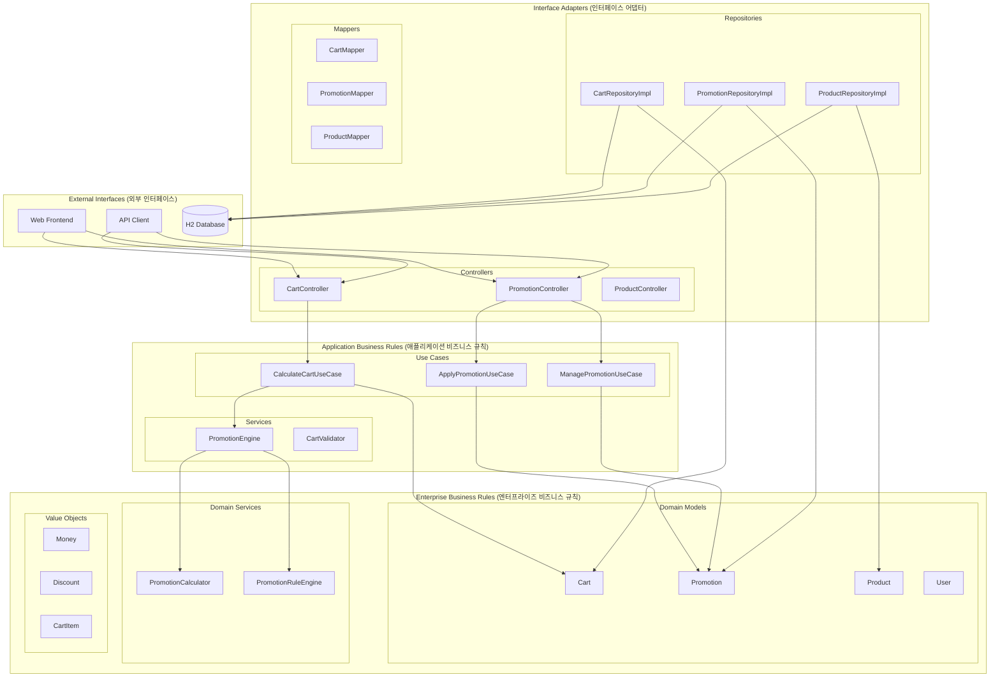
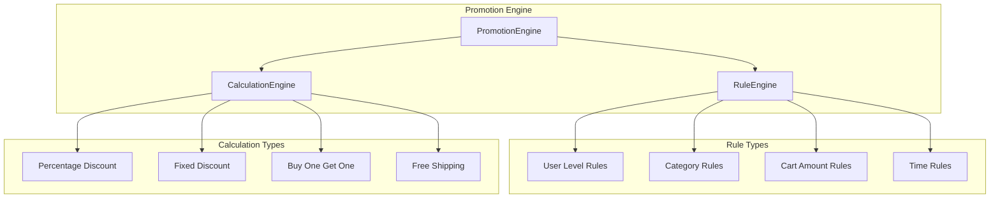

# 🏗️ 장바구니 프로모션 시스템 설계 문서 (Clean Architecture)

## 📋 목차
1. [시스템 개요](#1-시스템-개요)
2. [클린 아키텍처 설계](#2-클린-아키텍처-설계)
3. [도메인 모델 설계](#3-도메인-모델-설계)
4. [유스케이스 설계](#4-유스케이스-설계)
5. [인터페이스 설계](#5-인터페이스-설계)
6. [API 설계](#6-api-설계)
7. [프로모션 엔진 설계](#7-프로모션-엔진-설계)
8. [구현 계획](#8-구현-계획)
9. [테스트 전략](#9-테스트-전략)

---

## 1. 시스템 개요

### 1.1 목적
현재 Spring Boot 모놀리식 프로젝트에 장바구니 프로모션 기능을 추가하여 복수의 할인 정책을 자동 적용하는 시스템

### 1.2 핵심 기능
- **프로모션 정책 관리**: 다양한 할인 정책의 생성, 수정, 삭제
- **실시간 가격 계산**: 장바구니 상품에 대한 즉시 할인 적용
- **우선순위 처리**: 복잡한 할인 규칙의 우선순위 관리
- **중복 방지**: 상호 배타적인 할인 정책 처리
- **사용자 맞춤**: 사용자 등급, 결제 수단별 차별화된 할인

### 1.3 기술 스택
- **Backend**: Spring Boot 3.5.5, Kotlin 1.9.25
- **Database**: H2 (개발/테스트)
- **Build Tool**: Gradle
- **Java Version**: 21
- **Architecture**: Clean Architecture (클린 아키텍처)
- **Design Pattern**: Domain-Driven Design (DDD)

---

## 2. 클린 아키텍처 설계

### 2.1 클린 아키텍처 원칙

클린 아키텍처는 다음과 같은 핵심 원칙을 따릅니다:

- **의존성 역전**: 내부 레이어는 외부 레이어에 의존하지 않음
- **도메인 중심**: 비즈니스 로직이 도메인 레이어에 집중
- **테스트 용이성**: 각 레이어가 독립적으로 테스트 가능
- **유지보수성**: 변경사항이 다른 레이어에 미치는 영향 최소화

### 2.2 전체 아키텍처



### 2.3 클린 아키텍처 패키지 구조

```
com.example.demo/
├── domain/                          # 도메인 레이어 (Enterprise Business Rules)
│   ├── cart/
│   │   ├── model/
│   │   │   ├── Cart.kt
│   │   │   ├── CartItem.kt
│   │   │   └── CartTotal.kt
│   │   ├── valueobject/
│   │   │   ├── Money.kt
│   │   │   └── Quantity.kt
│   │   └── service/
│   │       └── CartValidator.kt
│   ├── product/
│   │   ├── model/
│   │   │   ├── Product.kt
│   │   │   └── ProductId.kt
│   │   └── valueobject/
│   │       ├── Price.kt
│   │       └── Stock.kt
│   ├── promotion/
│   │   ├── model/
│   │   │   ├── Promotion.kt
│   │   │   ├── PromotionId.kt
│   │   │   └── PromotionType.kt
│   │   ├── valueobject/
│   │   │   ├── Discount.kt
│   │   │   ├── DiscountPercentage.kt
│   │   │   └── DiscountAmount.kt
│   │   └── service/
│   │       ├── PromotionCalculator.kt
│   │       └── PromotionRuleEngine.kt
│   ├── user/
│   │   ├── model/
│   │   │   ├── User.kt
│   │   │   └── UserId.kt
│   │   └── valueobject/
│   │       ├── Email.kt
│   │       └── MembershipLevel.kt
│   └── common/
│       ├── exception/
│       │   ├── DomainException.kt
│       │   └── BusinessRuleViolationException.kt
│       └── valueobject/
│           └── EntityId.kt
├── application/                      # 애플리케이션 레이어 (Application Business Rules)
│   ├── cart/
│   │   ├── usecase/
│   │   │   ├── CalculateCartUseCase.kt
│   │   │   └── ValidateCartUseCase.kt
│   │   └── service/
│   │       └── CartService.kt
│   ├── product/
│   │   ├── usecase/
│   │   │   ├── CreateProductUseCase.kt
│   │   │   ├── GetProductUseCase.kt
│   │   │   └── SearchProductsUseCase.kt
│   │   └── service/
│   │       └── ProductService.kt
│   ├── promotion/
│   │   ├── usecase/
│   │   │   ├── ApplyPromotionUseCase.kt
│   │   │   ├── CreatePromotionUseCase.kt
│   │   │   └── ManagePromotionUseCase.kt
│   │   └── service/
│   │       └── PromotionEngine.kt
│   ├── user/
│   │   ├── usecase/
│   │   │   ├── CreateUserUseCase.kt
│   │   │   └── GetUserUseCase.kt
│   │   └── service/
│   │       └── UserService.kt
│   └── common/
│       ├── port/
│       │   ├── CartRepository.kt
│       │   ├── ProductRepository.kt
│       │   ├── PromotionRepository.kt
│       │   └── UserRepository.kt
│       └── dto/
│           ├── request/
│           └── response/
├── infrastructure/                   # 인프라스트럭처 레이어 (Interface Adapters)
│   ├── persistence/
│   │   ├── cart/
│   │   │   ├── CartRepositoryImpl.kt
│   │   │   ├── CartEntity.kt
│   │   │   └── CartMapper.kt
│   │   ├── product/
│   │   │   ├── ProductRepositoryImpl.kt
│   │   │   ├── ProductEntity.kt
│   │   │   └── ProductMapper.kt
│   │   ├── promotion/
│   │   │   ├── PromotionRepositoryImpl.kt
│   │   │   ├── PromotionEntity.kt
│   │   │   └── PromotionMapper.kt
│   │   └── user/
│   │       ├── UserRepositoryImpl.kt
│   │       ├── UserEntity.kt
│   │       └── UserMapper.kt
│   └── web/
│       ├── cart/
│       │   ├── CartController.kt
│       │   └── CartWebMapper.kt
│       ├── product/
│       │   ├── ProductController.kt
│       │   └── ProductWebMapper.kt
│       ├── promotion/
│       │   ├── PromotionController.kt
│       │   └── PromotionWebMapper.kt
│       └── user/
│           ├── UserController.kt
│           └── UserWebMapper.kt
├── config/                          # 설정
│   ├── DatabaseConfig.kt
│   ├── WebConfig.kt
│   └── PromotionConfig.kt
└── DemoApplication.kt
```

### 2.4 레이어별 책임

| 레이어 | 주요 책임 | 의존성 방향 |
|--------|-----------|-------------|
| **Domain** | 핵심 비즈니스 로직, 도메인 모델, 비즈니스 규칙 | 의존하지 않음 |
| **Application** | 유스케이스 구현, 애플리케이션 서비스, 포트 정의 | Domain에만 의존 |
| **Infrastructure** | 외부 시스템 연동, 데이터베이스, 웹 인터페이스 | Domain, Application에 의존 |
| **Interface** | 사용자 인터페이스, API 엔드포인트 | Application에 의존 |

### 2.5 의존성 규칙

1. **Domain 레이어**: 다른 레이어에 의존하지 않음
2. **Application 레이어**: Domain 레이어에만 의존
3. **Infrastructure 레이어**: Domain, Application 레이어에 의존
4. **Interface 레이어**: Application 레이어에 의존

### 2.6 포트와 어댑터 패턴

- **포트(Port)**: Application 레이어에서 정의하는 인터페이스
- **어댑터(Adapter)**: Infrastructure 레이어에서 포트를 구현하는 클래스
- **의존성 역전**: 고수준 모듈이 저수준 모듈에 의존하지 않고, 둘 다 추상화에 의존

---

## 3. 도메인 모델 설계

### 3.1 도메인 모델 vs 엔티티 분리

클린 아키텍처에서는 도메인 모델과 데이터베이스 엔티티를 분리합니다:

- **도메인 모델**: 비즈니스 로직과 규칙을 포함하는 순수한 객체
- **엔티티**: 데이터베이스 매핑을 위한 JPA 엔티티
- **매퍼**: 도메인 모델과 엔티티 간의 변환을 담당

### 3.2 핵심 도메인 모델

#### 3.2.1 Promotion 도메인 모델
```kotlin
// domain/promotion/model/Promotion.kt
data class Promotion(
    val id: PromotionId,
    val name: String,
    val description: String?,
    val type: PromotionType,
    val priority: Int,
    val isActive: Boolean,
    val period: PromotionPeriod,
    val conditions: PromotionConditions,
    val benefits: PromotionBenefits,
    val createdAt: LocalDateTime,
    val updatedAt: LocalDateTime
) {
    
    fun isApplicableTo(cart: Cart, user: User): Boolean {
        return isActive && 
               period.isValid() && 
               conditions.isSatisfiedBy(cart, user)
    }
    
    fun calculateDiscount(cart: Cart, user: User): Discount {
        if (!isApplicableTo(cart, user)) {
            return Discount.zero()
        }
        return benefits.calculateDiscount(cart)
    }
    
    fun activate() = copy(isActive = true)
    fun deactivate() = copy(isActive = false)
}

// domain/promotion/model/PromotionId.kt
@JvmInline
value class PromotionId(val value: Long)

// domain/promotion/valueobject/PromotionType.kt
enum class PromotionType {
    PERCENTAGE_DISCOUNT,
    FIXED_DISCOUNT,
    BUY_ONE_GET_ONE,
    FREE_SHIPPING,
    CASHBACK
}

// domain/promotion/valueobject/PromotionPeriod.kt
data class PromotionPeriod(
    val startDate: LocalDateTime,
    val endDate: LocalDateTime
) {
    fun isValid(): Boolean = LocalDateTime.now().let { now ->
        now.isAfter(startDate) && now.isBefore(endDate)
    }
}

// domain/promotion/valueobject/PromotionConditions.kt
data class PromotionConditions(
    val targetCategory: String? = null,
    val minCartAmount: Money? = null,
    val minQuantity: Quantity? = null,
    val targetUserLevel: MembershipLevel? = null
) {
    fun isSatisfiedBy(cart: Cart, user: User): Boolean {
        return (targetCategory == null || cart.hasCategory(targetCategory)) &&
               (minCartAmount == null || cart.totalAmount >= minCartAmount) &&
               (minQuantity == null || cart.totalQuantity >= minQuantity) &&
               (targetUserLevel == null || user.membershipLevel == targetUserLevel)
    }
}

// domain/promotion/valueobject/PromotionBenefits.kt
data class PromotionBenefits(
    val discountPercentage: DiscountPercentage? = null,
    val discountAmount: Money? = null,
    val maxDiscountAmount: Money? = null
) {
    fun calculateDiscount(cart: Cart): Discount {
        return when {
            discountPercentage != null -> {
                val discount = cart.totalAmount * discountPercentage
                val maxDiscount = maxDiscountAmount ?: discount
                Discount(minOf(discount, maxDiscount))
            }
            discountAmount != null -> {
                Discount(minOf(discountAmount, cart.totalAmount))
            }
            else -> Discount.zero()
        }
    }
}
```

#### 3.2.2 User 도메인 모델
```kotlin
// domain/user/model/User.kt
data class User(
    val id: UserId,
    val email: Email,
    val membershipLevel: MembershipLevel,
    val isNewCustomer: Boolean,
    val createdAt: LocalDateTime
) {
    fun isEligibleForPromotion(promotion: Promotion): Boolean {
        return promotion.conditions.targetUserLevel?.let { targetLevel ->
            membershipLevel >= targetLevel
        } ?: true
    }
    
    fun upgradeMembership(newLevel: MembershipLevel): User {
        return copy(membershipLevel = newLevel)
    }
}

// domain/user/model/UserId.kt
@JvmInline
value class UserId(val value: Long)

// domain/user/valueobject/Email.kt
@JvmInline
value class Email(val value: String) {
    init {
        require(value.matches(EMAIL_REGEX)) { "Invalid email format" }
    }
    
    companion object {
        private val EMAIL_REGEX = "^[A-Za-z0-9+_.-]+@[A-Za-z0-9.-]+\\.[A-Za-z]{2,}$".toRegex()
    }
}

// domain/user/valueobject/MembershipLevel.kt
enum class MembershipLevel(val priority: Int) {
    NEW(1),
    REGULAR(2),
    VIP(3),
    PREMIUM(4);
    
    operator fun compareTo(other: MembershipLevel): Int = this.priority.compareTo(other.priority)
}
```

#### 3.2.3 Cart 도메인 모델
```kotlin
// domain/cart/model/Cart.kt
data class Cart(
    val id: CartId,
    val userId: UserId,
    val items: List<CartItem>,
    val createdAt: LocalDateTime,
    val updatedAt: LocalDateTime
) {
    val totalAmount: Money
        get() = items.sumOf { it.totalPrice }
    
    val totalQuantity: Quantity
        get() = items.sumOf { it.quantity }
    
    fun hasCategory(category: String): Boolean {
        return items.any { it.product.category == category }
    }
    
    fun addItem(product: Product, quantity: Quantity): Cart {
        val existingItem = items.find { it.product.id == product.id }
        val updatedItems = if (existingItem != null) {
            items.map { item ->
                if (item.product.id == product.id) {
                    item.addQuantity(quantity)
                } else item
            }
        } else {
            items + CartItem(
                product = product,
                quantity = quantity,
                unitPrice = product.price
            )
        }
        return copy(items = updatedItems, updatedAt = LocalDateTime.now())
    }
    
    fun removeItem(productId: ProductId): Cart {
        val updatedItems = items.filter { it.product.id != productId }
        return copy(items = updatedItems, updatedAt = LocalDateTime.now())
    }
}

// domain/cart/model/CartId.kt
@JvmInline
value class CartId(val value: Long)

// domain/cart/model/CartItem.kt
data class CartItem(
    val product: Product,
    val quantity: Quantity,
    val unitPrice: Money
) {
    val totalPrice: Money
        get() = unitPrice * quantity.value
    
    fun addQuantity(additionalQuantity: Quantity): CartItem {
        return copy(quantity = quantity + additionalQuantity)
    }
    
    fun updateQuantity(newQuantity: Quantity): CartItem {
        return copy(quantity = newQuantity)
    }
}
```

#### 3.2.4 Product 도메인 모델
```kotlin
// domain/product/model/Product.kt
data class Product(
    val id: ProductId,
    val name: String,
    val description: String?,
    val price: Money,
    val stock: Stock,
    val category: String?,
    val brand: String?,
    val imageUrl: String?,
    val isActive: Boolean,
    val createdAt: LocalDateTime,
    val updatedAt: LocalDateTime
) {
    fun isAvailable(quantity: Quantity): Boolean {
        return isActive && stock.hasEnough(quantity)
    }
    
    fun reduceStock(quantity: Quantity): Product {
        return copy(stock = stock.reduce(quantity))
    }
    
    fun increaseStock(quantity: Quantity): Product {
        return copy(stock = stock.increase(quantity))
    }
}

// domain/product/model/ProductId.kt
@JvmInline
value class ProductId(val value: Long)
```

### 3.3 공통 값 객체 (Value Objects)

```kotlin
// domain/common/valueobject/Money.kt
@JvmInline
value class Money(val amount: BigDecimal) {
    init {
        require(amount >= BigDecimal.ZERO) { "Money amount cannot be negative" }
    }
    
    operator fun plus(other: Money): Money = Money(amount + other.amount)
    operator fun minus(other: Money): Money = Money(amount - other.amount)
    operator fun times(multiplier: BigDecimal): Money = Money(amount * multiplier)
    operator fun times(multiplier: Int): Money = Money(amount * BigDecimal(multiplier))
    operator fun compareTo(other: Money): Int = amount.compareTo(other.amount)
    
    companion object {
        fun zero() = Money(BigDecimal.ZERO)
    }
}

// domain/common/valueobject/Quantity.kt
@JvmInline
value class Quantity(val value: Int) {
    init {
        require(value > 0) { "Quantity must be positive" }
    }
    
    operator fun plus(other: Quantity): Quantity = Quantity(value + other.value)
    operator fun minus(other: Quantity): Quantity = Quantity(value - other.value)
    operator fun times(multiplier: Int): Quantity = Quantity(value * multiplier)
    operator fun compareTo(other: Quantity): Int = value.compareTo(other.value)
}

// domain/common/valueobject/Stock.kt
@JvmInline
value class Stock(val quantity: Int) {
    init {
        require(quantity >= 0) { "Stock quantity cannot be negative" }
    }
    
    fun hasEnough(required: Quantity): Boolean = quantity >= required.value
    fun reduce(amount: Quantity): Stock = Stock(quantity - amount.value)
    fun increase(amount: Quantity): Stock = Stock(quantity + amount.value)
    fun isEmpty(): Boolean = quantity == 0
}

// domain/promotion/valueobject/Discount.kt
@JvmInline
value class Discount(val amount: Money) {
    init {
        require(amount.amount >= BigDecimal.ZERO) { "Discount cannot be negative" }
    }
    
    operator fun plus(other: Discount): Discount = Discount(amount + other.amount)
    operator fun minus(other: Discount): Discount = Discount(amount - other.amount)
    operator fun compareTo(other: Discount): Int = amount.compareTo(other.amount)
    
    companion object {
        fun zero() = Discount(Money.zero())
    }
}

// domain/promotion/valueobject/DiscountPercentage.kt
@JvmInline
value class DiscountPercentage(val value: BigDecimal) {
    init {
        require(value >= BigDecimal.ZERO && value <= BigDecimal(100)) { 
            "Discount percentage must be between 0 and 100" 
        }
    }
    
    operator fun times(money: Money): Money = Money(money.amount * (value / BigDecimal(100)))
}
```

### 3.4 데이터베이스 엔티티 (Infrastructure Layer)

도메인 모델과 분리된 JPA 엔티티들:

```kotlin
// infrastructure/persistence/promotion/PromotionEntity.kt
@Entity
@Table(name = "promotions")
data class PromotionEntity(
    @Id
    @GeneratedValue(strategy = GenerationType.IDENTITY)
    val id: Long? = null,
    
    @Column(nullable = false, length = 100)
    val name: String,
    
    @Column(length = 500)
    val description: String? = null,
    
    @Enumerated(EnumType.STRING)
    @Column(nullable = false)
    val type: String,
    
    @Column(nullable = false)
    val priority: Int,
    
    @Column(nullable = false)
    val isActive: Boolean = true,
    
    @Column(nullable = false)
    val startDate: LocalDateTime,
    
    @Column(nullable = false)
    val endDate: LocalDateTime,
    
    @Column(length = 50)
    val targetCategory: String? = null,
    
    @Column(precision = 10, scale = 2)
    val minCartAmount: BigDecimal? = null,
    
    @Column
    val minQuantity: Int? = null,
    
    @Enumerated(EnumType.STRING)
    val targetUserLevel: String? = null,
    
    @Column(precision = 5, scale = 2)
    val discountPercentage: BigDecimal? = null,
    
    @Column(precision = 10, scale = 2)
    val discountAmount: BigDecimal? = null,
    
    @Column(precision = 10, scale = 2)
    val maxDiscountAmount: BigDecimal? = null,
    
    @Column(nullable = false)
    val createdAt: LocalDateTime = LocalDateTime.now(),
    
    @Column(nullable = false)
    val updatedAt: LocalDateTime = LocalDateTime.now()
)
```

### 3.5 도메인-엔티티 매핑

```kotlin
// infrastructure/persistence/promotion/PromotionMapper.kt
@Component
class PromotionMapper {
    
    fun toDomain(entity: PromotionEntity): Promotion {
        return Promotion(
            id = PromotionId(entity.id!!),
            name = entity.name,
            description = entity.description,
            type = PromotionType.valueOf(entity.type),
            priority = entity.priority,
            isActive = entity.isActive,
            period = PromotionPeriod(entity.startDate, entity.endDate),
            conditions = PromotionConditions(
                targetCategory = entity.targetCategory,
                minCartAmount = entity.minCartAmount?.let { Money(it) },
                minQuantity = entity.minQuantity?.let { Quantity(it) },
                targetUserLevel = entity.targetUserLevel?.let { MembershipLevel.valueOf(it) }
            ),
            benefits = PromotionBenefits(
                discountPercentage = entity.discountPercentage?.let { DiscountPercentage(it) },
                discountAmount = entity.discountAmount?.let { Money(it) },
                maxDiscountAmount = entity.maxDiscountAmount?.let { Money(it) }
            ),
            createdAt = entity.createdAt,
            updatedAt = entity.updatedAt
        )
    }
    
    fun toEntity(domain: Promotion): PromotionEntity {
        return PromotionEntity(
            id = domain.id.value.takeIf { it > 0 },
            name = domain.name,
            description = domain.description,
            type = domain.type.name,
            priority = domain.priority,
            isActive = domain.isActive,
            startDate = domain.period.startDate,
            endDate = domain.period.endDate,
            targetCategory = domain.conditions.targetCategory,
            minCartAmount = domain.conditions.minCartAmount?.amount,
            minQuantity = domain.conditions.minQuantity?.value,
            targetUserLevel = domain.conditions.targetUserLevel?.name,
            discountPercentage = domain.benefits.discountPercentage?.value,
            discountAmount = domain.benefits.discountAmount?.amount,
            maxDiscountAmount = domain.benefits.maxDiscountAmount?.amount,
            createdAt = domain.createdAt,
            updatedAt = domain.updatedAt
        )
    }
}
```

---

## 4. 유스케이스 설계

### 4.1 유스케이스 정의

클린 아키텍처에서 유스케이스는 애플리케이션의 핵심 비즈니스 로직을 캡슐화합니다.

#### 4.1.1 장바구니 계산 유스케이스
```kotlin
// application/cart/usecase/CalculateCartUseCase.kt
@UseCase
class CalculateCartUseCase(
    private val cartRepository: CartRepository,
    private val productRepository: ProductRepository,
    private val promotionEngine: PromotionEngine
) {
    
    fun execute(request: CalculateCartRequest): CalculateCartResponse {
        // 1. 장바구니 아이템 검증
        val cartItems = validateAndBuildCartItems(request.items)
        
        // 2. 장바구니 생성
        val cart = Cart(
            id = CartId(0), // 새 장바구니
            userId = UserId(request.userId),
            items = cartItems,
            createdAt = LocalDateTime.now(),
            updatedAt = LocalDateTime.now()
        )
        
        // 3. 사용자 정보 조회
        val user = cartRepository.findUserById(UserId(request.userId))
            ?: throw UserNotFoundException("User not found: ${request.userId}")
        
        // 4. 프로모션 적용
        val promotionResult = promotionEngine.applyPromotions(cart, user)
        
        // 5. 최종 계산 결과 반환
        return CalculateCartResponse(
            items = cartItems.map { item ->
                CartItemResponse(
                    productId = item.product.id.value,
                    productName = item.product.name,
                    unitPrice = item.unitPrice.amount,
                    quantity = item.quantity.value,
                    totalPrice = item.totalPrice.amount
                )
            },
            subtotal = cart.totalAmount.amount,
            totalDiscount = promotionResult.totalDiscount.amount,
            finalAmount = promotionResult.finalAmount.amount,
            appliedPromotions = promotionResult.appliedPromotions
        )
    }
    
    private fun validateAndBuildCartItems(itemRequests: List<CartItemRequest>): List<CartItem> {
        return itemRequests.map { itemRequest ->
            val product = productRepository.findById(ProductId(itemRequest.productId))
                ?: throw ProductNotFoundException("Product not found: ${itemRequest.productId}")
            
            val quantity = Quantity(itemRequest.quantity)
            
            if (!product.isAvailable(quantity)) {
                throw InsufficientStockException("Insufficient stock for product: ${product.name}")
            }
            
            CartItem(
                product = product,
                quantity = quantity,
                unitPrice = product.price
            )
        }
    }
}
```

#### 4.1.2 프로모션 적용 유스케이스
```kotlin
// application/promotion/usecase/ApplyPromotionUseCase.kt
@UseCase
class ApplyPromotionUseCase(
    private val promotionRepository: PromotionRepository,
    private val promotionEngine: PromotionEngine
) {
    
    fun execute(request: ApplyPromotionRequest): ApplyPromotionResponse {
        // 1. 활성 프로모션 조회
        val activePromotions = promotionRepository.findActivePromotions()
        
        // 2. 장바구니와 사용자 정보로 프로모션 적용
        val result = promotionEngine.applyPromotions(request.cart, request.user)
        
        return ApplyPromotionResponse(
            appliedPromotions = result.appliedPromotions,
            totalDiscount = result.totalDiscount.amount,
            finalAmount = result.finalAmount.amount
        )
    }
}
```

#### 4.1.3 프로모션 관리 유스케이스
```kotlin
// application/promotion/usecase/CreatePromotionUseCase.kt
@UseCase
class CreatePromotionUseCase(
    private val promotionRepository: PromotionRepository
) {
    
    fun execute(request: CreatePromotionRequest): CreatePromotionResponse {
        // 1. 프로모션 도메인 모델 생성
        val promotion = Promotion(
            id = PromotionId(0), // 새 프로모션
            name = request.name,
            description = request.description,
            type = PromotionType.valueOf(request.type),
            priority = request.priority,
            isActive = true,
            period = PromotionPeriod(request.startDate, request.endDate),
            conditions = PromotionConditions(
                targetCategory = request.targetCategory,
                minCartAmount = request.minCartAmount?.let { Money(it) },
                minQuantity = request.minQuantity?.let { Quantity(it) },
                targetUserLevel = request.targetUserLevel?.let { MembershipLevel.valueOf(it) }
            ),
            benefits = PromotionBenefits(
                discountPercentage = request.discountPercentage?.let { DiscountPercentage(it) },
                discountAmount = request.discountAmount?.let { Money(it) },
                maxDiscountAmount = request.maxDiscountAmount?.let { Money(it) }
            ),
            createdAt = LocalDateTime.now(),
            updatedAt = LocalDateTime.now()
        )
        
        // 2. 프로모션 저장
        val savedPromotion = promotionRepository.save(promotion)
        
        return CreatePromotionResponse(
            promotionId = savedPromotion.id.value,
            name = savedPromotion.name,
            isActive = savedPromotion.isActive
        )
    }
}
```

### 4.2 포트 인터페이스 정의

```kotlin
// application/common/port/CartRepository.kt
interface CartRepository {
    fun findUserById(userId: UserId): User?
    fun save(cart: Cart): Cart
    fun findById(cartId: CartId): Cart?
}

// application/common/port/ProductRepository.kt
interface ProductRepository {
    fun findById(productId: ProductId): Product?
    fun findAll(): List<Product>
    fun findByCategory(category: String): List<Product>
}

// application/common/port/PromotionRepository.kt
interface PromotionRepository {
    fun findActivePromotions(): List<Promotion>
    fun findById(promotionId: PromotionId): Promotion?
    fun save(promotion: Promotion): Promotion
    fun delete(promotionId: PromotionId)
}

// application/common/port/UserRepository.kt
interface UserRepository {
    fun findById(userId: UserId): User?
    fun save(user: User): User
    fun findByEmail(email: Email): User?
}
```

## 5. 인터페이스 설계

### 5.1 웹 컨트롤러 (Infrastructure Layer)

```kotlin
// infrastructure/web/cart/CartController.kt
@RestController
@RequestMapping("/api/cart")
class CartController(
    private val calculateCartUseCase: CalculateCartUseCase,
    private val validateCartUseCase: ValidateCartUseCase,
    private val cartWebMapper: CartWebMapper
) {
    
    @PostMapping("/calculate")
    fun calculateCartTotal(@RequestBody request: CartRequest): ResponseEntity<CartResponse> {
        val useCaseRequest = cartWebMapper.toCalculateCartRequest(request)
        val useCaseResponse = calculateCartUseCase.execute(useCaseRequest)
        val response = cartWebMapper.toCartResponse(useCaseResponse)
        return ResponseEntity.ok(response)
    }
    
    @PostMapping("/validate")
    fun validateCartItems(@RequestBody request: CartRequest): ResponseEntity<Map<String, Any>> {
        val useCaseRequest = cartWebMapper.toValidateCartRequest(request)
        val useCaseResponse = validateCartUseCase.execute(useCaseRequest)
        val response = cartWebMapper.toValidationResponse(useCaseResponse)
        return ResponseEntity.ok(response)
    }
}

// infrastructure/web/cart/CartWebMapper.kt
@Component
class CartWebMapper {
    
    fun toCalculateCartRequest(request: CartRequest): CalculateCartRequest {
        return CalculateCartRequest(
            userId = request.userId,
            items = request.items.map { item ->
                CartItemRequest(
                    productId = item.productId,
                    quantity = item.quantity
                )
            }
        )
    }
    
    fun toCartResponse(response: CalculateCartResponse): CartResponse {
        return CartResponse(
            items = response.items,
            totalPrice = response.finalAmount,
            totalItems = response.items.sumOf { it.quantity },
            appliedPromotions = response.appliedPromotions
        )
    }
}
```

### 5.2 리포지토리 구현 (Infrastructure Layer)

```kotlin
// infrastructure/persistence/promotion/PromotionRepositoryImpl.kt
@Repository
class PromotionRepositoryImpl(
    private val promotionJpaRepository: PromotionJpaRepository,
    private val promotionMapper: PromotionMapper
) : PromotionRepository {
    
    override fun findActivePromotions(): List<Promotion> {
        val entities = promotionJpaRepository.findByIsActiveTrueAndStartDateBeforeAndEndDateAfter(
            LocalDateTime.now(), LocalDateTime.now()
        )
        return entities.map { promotionMapper.toDomain(it) }
    }
    
    override fun findById(promotionId: PromotionId): Promotion? {
        return promotionJpaRepository.findById(promotionId.value)
            .map { promotionMapper.toDomain(it) }
            .orElse(null)
    }
    
    override fun save(promotion: Promotion): Promotion {
        val entity = promotionMapper.toEntity(promotion)
        val savedEntity = promotionJpaRepository.save(entity)
        return promotionMapper.toDomain(savedEntity)
    }
    
    override fun delete(promotionId: PromotionId) {
        promotionJpaRepository.deleteById(promotionId.value)
    }
}

// infrastructure/persistence/promotion/PromotionJpaRepository.kt
interface PromotionJpaRepository : JpaRepository<PromotionEntity, Long> {
    fun findByIsActiveTrueAndStartDateBeforeAndEndDateAfter(
        startDate: LocalDateTime, 
        endDate: LocalDateTime
    ): List<PromotionEntity>
}
```

## 6. API 설계

### 6.1 장바구니 관련 API

#### 6.1.1 장바구니 가격 계산 (프로모션 적용)
```http
POST /api/cart/calculate-with-promotions
Content-Type: application/json

{
  "userId": 123,
  "items": [
    {
      "productId": 1,
      "quantity": 2
    },
    {
      "productId": 2,
      "quantity": 1
    }
  ]
}
```

**응답:**
```json
{
  "items": [
    {
      "productId": 1,
      "productName": "상품 A",
      "unitPrice": 50000,
      "quantity": 2,
      "totalPrice": 100000,
      "appliedPromotions": [
        {
          "promotionId": 1,
          "promotionName": "VIP 5% 할인",
          "discountAmount": 5000
        }
      ]
    }
  ],
  "subtotal": 100000,
  "totalDiscount": 5000,
  "shippingFee": 0,
  "finalAmount": 95000,
  "appliedPromotions": [
    {
      "promotionId": 1,
      "promotionName": "VIP 5% 할인",
      "discountAmount": 5000
    },
    {
      "promotionId": 2,
      "promotionName": "무료 배송",
      "discountAmount": 3000
    }
  ]
}
```

### 6.2 프로모션 관리 API

#### 6.2.1 프로모션 생성
```http
POST /api/promotions
Content-Type: application/json

{
  "name": "VIP 회원 5% 할인",
  "description": "VIP 회원 대상 5% 할인",
  "type": "PERCENTAGE_DISCOUNT",
  "priority": 3,
  "startDate": "2024-01-01T00:00:00",
  "endDate": "2024-12-31T23:59:59",
  "targetUserLevel": "VIP",
  "minCartAmount": 50000,
  "discountPercentage": 5.0,
  "maxDiscountAmount": 10000
}
```

#### 6.2.2 프로모션 목록 조회
```http
GET /api/promotions?active=true
```

#### 6.2.3 프로모션 상세 조회
```http
GET /api/promotions/{id}
```

#### 6.2.4 프로모션 수정
```http
PUT /api/promotions/{id}
Content-Type: application/json

{
  "name": "VIP 회원 7% 할인",
  "discountPercentage": 7.0
}
```

### 6.3 사용자 관리 API

#### 6.3.1 사용자 생성
```http
POST /api/users
Content-Type: application/json

{
  "email": "user@example.com",
  "membershipLevel": "VIP",
  "isNewCustomer": false
}
```

#### 6.3.2 사용자 조회
```http
GET /api/users/{id}
```

---

## 7. 프로모션 엔진 설계

### 7.1 프로모션 엔진 아키텍처



### 7.2 프로모션 엔진 구현

```kotlin
// application/promotion/service/PromotionEngine.kt
@Service
class PromotionEngine(
    private val promotionRepository: PromotionRepository,
    private val promotionCalculator: PromotionCalculator,
    private val promotionRuleEngine: PromotionRuleEngine
) {
    
    fun applyPromotions(cart: Cart, user: User): PromotionResult {
        // 1. 활성 프로모션 조회
        val activePromotions = promotionRepository.findActivePromotions()
        
        // 2. 적용 가능한 프로모션 필터링
        val applicablePromotions = activePromotions.filter { promotion ->
            promotion.isApplicableTo(cart, user)
        }
        
        // 3. 우선순위 정렬
        val sortedPromotions = applicablePromotions.sortedBy { it.priority }
        
        // 4. 할인 계산
        return promotionCalculator.calculateDiscounts(cart, sortedPromotions, user)
    }
}

// domain/promotion/service/PromotionCalculator.kt
class PromotionCalculator {
    
    fun calculateDiscounts(
        cart: Cart, 
        promotions: List<Promotion>,
        user: User
    ): PromotionResult {
        var totalDiscount = Discount.zero()
        val appliedPromotions = mutableListOf<AppliedPromotion>()
        
        for (promotion in promotions) {
            val discount = promotion.calculateDiscount(cart, user)
            if (discount.amount.amount > BigDecimal.ZERO) {
                totalDiscount += discount
                appliedPromotions.add(AppliedPromotion(
                    promotionId = promotion.id.value,
                    promotionName = promotion.name,
                    discountAmount = discount.amount.amount
                ))
            }
        }
        
        val finalAmount = cart.totalAmount - totalDiscount.amount
        
        return PromotionResult(
            subtotal = cart.totalAmount.amount,
            totalDiscount = totalDiscount.amount.amount,
            finalAmount = finalAmount.amount,
            appliedPromotions = appliedPromotions
        )
    }
}

// domain/promotion/service/PromotionRuleEngine.kt
class PromotionRuleEngine {
    
    fun evaluateRules(promotion: Promotion, cart: Cart, user: User): Boolean {
        return promotion.conditions.isSatisfiedBy(cart, user) &&
               promotion.period.isValid() &&
               user.isEligibleForPromotion(promotion)
    }
}

// application/common/dto/response/PromotionResult.kt
data class PromotionResult(
    val subtotal: BigDecimal,
    val totalDiscount: BigDecimal,
    val finalAmount: BigDecimal,
    val appliedPromotions: List<AppliedPromotion>
)

data class AppliedPromotion(
    val promotionId: Long,
    val promotionName: String,
    val discountAmount: BigDecimal
)
```

---

## 8. 구현 계획

### 8.1 클린 아키텍처 구현 단계

#### Phase 1: 도메인 레이어 구현 (1주)
- [ ] 도메인 모델 구현 (Promotion, User, Cart, Product)
- [ ] 값 객체 구현 (Money, Quantity, Discount 등)
- [ ] 도메인 서비스 구현 (PromotionCalculator, PromotionRuleEngine)
- [ ] 도메인 예외 정의

#### Phase 2: 애플리케이션 레이어 구현 (1주)
- [ ] 유스케이스 구현 (CalculateCartUseCase, ApplyPromotionUseCase 등)
- [ ] 포트 인터페이스 정의 (Repository 인터페이스)
- [ ] 애플리케이션 서비스 구현
- [ ] DTO 정의

#### Phase 3: 인프라스트럭처 레이어 구현 (1주)
- [ ] JPA 엔티티 구현
- [ ] 리포지토리 구현체 작성
- [ ] 매퍼 구현 (도메인-엔티티 변환)
- [ ] 데이터베이스 설정

#### Phase 4: 인터페이스 레이어 구현 (1주)
- [ ] 웹 컨트롤러 구현
- [ ] 웹 매퍼 구현 (웹 DTO-유스케이스 DTO 변환)
- [ ] API 엔드포인트 구현
- [ ] 예외 처리 및 응답 포맷팅

#### Phase 5: 테스트 및 최적화 (1주)
- [ ] 도메인 모델 단위 테스트
- [ ] 유스케이스 단위 테스트
- [ ] 통합 테스트
- [ ] 성능 테스트 및 최적화

### 8.2 구현 우선순위

1. **높음**: 도메인 모델과 값 객체 (비즈니스 규칙의 핵심)
2. **중간**: 유스케이스와 포트 인터페이스 (애플리케이션 로직)
3. **낮음**: 인프라스트럭처 구현체 (외부 시스템 연동)

---

## 9. 테스트 전략

### 9.1 클린 아키텍처 테스트 전략

클린 아키텍처에서는 각 레이어별로 다른 테스트 전략을 적용합니다:

- **도메인 레이어**: 순수한 단위 테스트 (외부 의존성 없음)
- **애플리케이션 레이어**: 유스케이스 단위 테스트 (포트 모킹)
- **인프라스트럭처 레이어**: 통합 테스트 (실제 데이터베이스 사용)
- **인터페이스 레이어**: 웹 계층 테스트 (MockMvc 사용)

### 9.2 테스트 라이브러리 설정

```kotlin
// build.gradle.kts
dependencies {
    testImplementation("io.kotest:kotest-runner-junit5:5.8.0")
    testImplementation("io.kotest:kotest-assertions-core:5.8.0")
    testImplementation("io.kotest:kotest-property:5.8.0")
    testImplementation("io.kotest:kotest-framework-datatest:5.8.0")
    testImplementation("io.mockk:mockk:1.13.8")
    testImplementation("org.jetbrains.kotlin:kotlin-test")
}
```

### 9.3 도메인 모델 단위 테스트

#### 9.3.1 도메인 모델 테스트

```kotlin
// domain/promotion/model/PromotionTest.kt
class PromotionTest : FunSpec({
    
    context("프로모션 적용 조건 검증") {
    
        test("VIP 사용자에게 VIP 전용 프로모션이 적용되어야 한다") {
            // Given
            val user = User(
                id = UserId(1L),
                email = Email("vip@test.com"),
                membershipLevel = MembershipLevel.VIP,
                isNewCustomer = false,
                createdAt = LocalDateTime.now()
            )
            val product = Product(
                id = ProductId(1L),
                name = "상품", 
                price = Money(BigDecimal(50000)),
                stock = Stock(100),
                category = "전자제품",
                brand = "테스트 브랜드",
                imageUrl = null,
                isActive = true,
                createdAt = LocalDateTime.now(),
                updatedAt = LocalDateTime.now()
            )
            val cart = Cart(
                id = CartId(1L),
                userId = UserId(1L),
                items = listOf(
                    CartItem(
                        product = product,
                        quantity = Quantity(2),
                        unitPrice = product.price
                    )
                ),
                createdAt = LocalDateTime.now(),
                updatedAt = LocalDateTime.now()
            )
            val promotion = Promotion(
                id = PromotionId(1L),
                name = "VIP 할인",
                description = "VIP 회원 전용 할인",
                type = PromotionType.PERCENTAGE_DISCOUNT,
                priority = 1,
                isActive = true,
                period = PromotionPeriod(
                startDate = LocalDateTime.now().minusDays(1),
                endDate = LocalDateTime.now().plusDays(30)
                ),
                conditions = PromotionConditions(
                    targetUserLevel = MembershipLevel.VIP,
                    minCartAmount = Money(BigDecimal(50000))
                ),
                benefits = PromotionBenefits(
                    discountPercentage = DiscountPercentage(BigDecimal(5))
                ),
                createdAt = LocalDateTime.now(),
                updatedAt = LocalDateTime.now()
            )
            
            // When & Then
            promotion.isApplicableTo(cart, user) shouldBe true
        }
        
        test("일반 사용자에게 VIP 전용 프로모션이 적용되지 않아야 한다") {
            // Given
            val user = User(
                id = UserId(1L),
                email = Email("regular@test.com"),
                membershipLevel = MembershipLevel.REGULAR,
                isNewCustomer = false,
                createdAt = LocalDateTime.now()
            )
            val cart = Cart(
                id = CartId(1L),
                userId = UserId(1L),
                items = emptyList(),
                createdAt = LocalDateTime.now(),
                updatedAt = LocalDateTime.now()
            )
            val promotion = Promotion(
                id = PromotionId(1L),
                name = "VIP 할인",
                description = "VIP 회원 전용 할인",
                type = PromotionType.PERCENTAGE_DISCOUNT,
                priority = 1,
                isActive = true,
                period = PromotionPeriod(
                startDate = LocalDateTime.now().minusDays(1),
                endDate = LocalDateTime.now().plusDays(30)
                ),
                conditions = PromotionConditions(
                    targetUserLevel = MembershipLevel.VIP
                ),
                benefits = PromotionBenefits(
                    discountPercentage = DiscountPercentage(BigDecimal(5))
                ),
                createdAt = LocalDateTime.now(),
                updatedAt = LocalDateTime.now()
            )
            
            // When & Then
            promotion.isApplicableTo(cart, user) shouldBe false
        }
    }
    
    context("프로모션 할인 계산") {
        
        test("퍼센트 할인이 올바르게 계산되어야 한다") {
            // Given
            val user = User(
                id = UserId(1L),
                email = Email("test@test.com"),
                membershipLevel = MembershipLevel.REGULAR,
                isNewCustomer = false,
                createdAt = LocalDateTime.now()
            )
            val product = Product(
                id = ProductId(1L),
                name = "상품", 
                price = Money(BigDecimal(100000)),
                stock = Stock(100),
                category = "전자제품",
                brand = "테스트 브랜드",
                imageUrl = null,
                isActive = true,
                createdAt = LocalDateTime.now(),
                updatedAt = LocalDateTime.now()
            )
            val cart = Cart(
                id = CartId(1L),
                userId = UserId(1L),
                items = listOf(
                    CartItem(
                        product = product,
                        quantity = Quantity(1),
                        unitPrice = product.price
                    )
                ),
                createdAt = LocalDateTime.now(),
                updatedAt = LocalDateTime.now()
            )
            val promotion = Promotion(
                id = PromotionId(1L),
                name = "10% 할인",
                description = "10% 할인",
                type = PromotionType.PERCENTAGE_DISCOUNT,
                priority = 1,
                isActive = true,
                period = PromotionPeriod(
                startDate = LocalDateTime.now().minusDays(1),
                endDate = LocalDateTime.now().plusDays(30)
                ),
                conditions = PromotionConditions(),
                benefits = PromotionBenefits(
                    discountPercentage = DiscountPercentage(BigDecimal(10))
                ),
                createdAt = LocalDateTime.now(),
                updatedAt = LocalDateTime.now()
            )
            
            // When
            val discount = promotion.calculateDiscount(cart, user)
            
            // Then
            discount.amount.amount shouldBe BigDecimal(10000) // 100000 * 0.1
        }
    }
})
```

#### 9.3.2 유스케이스 테스트

```kotlin
// application/cart/usecase/CalculateCartUseCaseTest.kt
class CalculateCartUseCaseTest : FunSpec({
    
    val mockCartRepository = mockk<CartRepository>()
    val mockProductRepository = mockk<ProductRepository>()
    val mockPromotionEngine = mockk<PromotionEngine>()
    val useCase = CalculateCartUseCase(mockCartRepository, mockProductRepository, mockPromotionEngine)
    
    context("장바구니 계산") {
        
        test("정상적인 장바구니 계산이 성공해야 한다") {
            // Given
            val request = CalculateCartRequest(
                userId = 1L,
                items = listOf(
                    CartItemRequest(productId = 1L, quantity = 2)
                )
            )
            val user = User(
                id = UserId(1L),
                email = Email("test@test.com"),
                membershipLevel = MembershipLevel.REGULAR,
                isNewCustomer = false,
                createdAt = LocalDateTime.now()
            )
            val product = Product(
                id = ProductId(1L),
                name = "상품",
                price = Money(BigDecimal(50000)),
                stock = Stock(100),
                category = "전자제품",
                brand = "테스트 브랜드",
                imageUrl = null,
                isActive = true,
                createdAt = LocalDateTime.now(),
                updatedAt = LocalDateTime.now()
            )
            val promotionResult = PromotionResult(
                subtotal = BigDecimal(100000),
                totalDiscount = BigDecimal(5000),
                finalAmount = BigDecimal(95000),
                appliedPromotions = emptyList()
            )
            
            every { mockCartRepository.findUserById(UserId(1L)) } returns user
            every { mockProductRepository.findById(ProductId(1L)) } returns product
            every { mockPromotionEngine.applyPromotions(any(), any()) } returns promotionResult
            
            // When
            val result = useCase.execute(request)
            
            // Then
            result.finalAmount shouldBe BigDecimal(95000)
            result.subtotal shouldBe BigDecimal(100000)
            result.totalDiscount shouldBe BigDecimal(5000)
        }
    }
})
```

### 9.4 통합 테스트

```kotlin
// infrastructure/web/cart/CartControllerIntegrationTest.kt
@SpringBootTest
@AutoConfigureTestDatabase(replace = AutoConfigureTestDatabase.Replace.NONE)
@Transactional
class CartControllerIntegrationTest : FunSpec({
    
    @Autowired
    lateinit var mockMvc: MockMvc
    
    @Autowired
    lateinit var testEntityManager: TestEntityManager
    
    context("장바구니 계산 API") {
        
        test("프로모션이 적용된 장바구니 계산이 성공해야 한다") {
                // Given
            val user = createTestUser()
            val product = createTestProduct()
            val promotion = createTestPromotion()
            
            val request = CartRequest(
                userId = user.id!!,
                items = listOf(
                    CartItemRequest(productId = product.id!!, quantity = 2)
                )
            )
            
            // When & Then
            mockMvc.perform(
                post("/api/cart/calculate")
                    .contentType(MediaType.APPLICATION_JSON)
                    .content(objectMapper.writeValueAsString(request))
            )
                .andExpect(status().isOk)
                .andExpect(jsonPath("$.finalAmount").isNumber)
                .andExpect(jsonPath("$.totalDiscount").isNumber)
        }
    }
})
```

---

## 10. 결론

이 설계는 클린 아키텍처 원칙을 적용하여 장바구니 프로모션 시스템을 구축하는 방법을 제시합니다.

### 10.1 클린 아키텍처의 장점

#### 10.1.1 비즈니스 로직의 독립성
- **도메인 중심**: 핵심 비즈니스 로직이 도메인 레이어에 집중
- **기술 독립성**: 데이터베이스나 웹 프레임워크 변경이 비즈니스 로직에 영향 없음
- **테스트 용이성**: 각 레이어가 독립적으로 테스트 가능

#### 10.1.2 유지보수성과 확장성
- **의존성 역전**: 고수준 모듈이 저수준 모듈에 의존하지 않음
- **단일 책임**: 각 클래스와 모듈이 명확한 단일 책임을 가짐
- **개방-폐쇄 원칙**: 확장에는 열려있고 수정에는 닫혀있는 구조

#### 10.1.3 코드 품질 향상
- **가독성**: 명확한 레이어 분리로 코드 이해도 향상
- **재사용성**: 도메인 모델과 유스케이스의 높은 재사용성
- **확장성**: 새로운 기능 추가 시 기존 코드 변경 최소화

### 10.2 구현 시 고려사항

#### 10.2.1 도메인 모델 설계
- **값 객체 활용**: Money, Quantity 등 불변 값 객체로 타입 안전성 확보
- **비즈니스 규칙 캡슐화**: 도메인 모델 내부에 비즈니스 로직 포함
- **예외 처리**: 도메인 예외를 통한 명확한 에러 처리

#### 10.2.2 유스케이스 설계
- **단일 책임**: 각 유스케이스는 하나의 비즈니스 시나리오만 처리
- **포트-어댑터 패턴**: 외부 의존성을 인터페이스로 추상화
- **트랜잭션 관리**: 유스케이스 레벨에서 트랜잭션 경계 설정

#### 10.2.3 인프라스트럭처 설계
- **매퍼 구현**: 도메인 모델과 엔티티 간의 변환 로직 분리
- **리포지토리 패턴**: 데이터 접근 로직을 인터페이스로 추상화
- **설정 관리**: 환경별 설정을 통한 유연한 구성

### 10.3 성능 및 확장성

#### 10.3.1 성능 최적화
- **캐싱 전략**: 프로모션 데이터 캐싱으로 조회 성능 향상
- **비동기 처리**: 대용량 프로모션 계산 시 비동기 처리 고려
- **데이터베이스 최적화**: 인덱스 설계 및 쿼리 최적화

#### 10.3.2 확장성 고려사항
- **마이크로서비스 분리**: 도메인별 서비스 분리 가능한 구조
- **이벤트 기반 아키텍처**: 도메인 이벤트를 통한 느슨한 결합
- **API 버전 관리**: 하위 호환성을 고려한 API 설계

### 10.4 향후 개선 방향

#### 10.4.1 도메인 주도 설계 (DDD) 적용
- **애그리게이트**: 관련 엔티티들을 하나의 애그리게이트로 관리
- **도메인 이벤트**: 비즈니스 이벤트를 통한 시스템 간 통신
- **바운디드 컨텍스트**: 도메인별 경계 명확화

#### 10.4.2 고급 기능 추가
- **복잡한 프로모션 규칙**: 조합형 프로모션, 조건부 할인 등
- **실시간 프로모션**: 동적 프로모션 생성 및 적용
- **머신러닝 기반**: 사용자 행동 분석을 통한 개인화 프로모션

#### 10.4.3 모니터링 및 관찰성
- **메트릭 수집**: 프로모션 적용률, 성능 지표 수집
- **로깅 전략**: 구조화된 로깅을 통한 디버깅 및 분석
- **분산 추적**: 마이크로서비스 환경에서의 요청 추적

### 10.5 학습 효과

이 클린 아키텍처 설계를 통해 다음과 같은 소프트웨어 개발 원칙을 학습할 수 있습니다:

- **SOLID 원칙**: 단일 책임, 개방-폐쇄, 리스코프 치환, 인터페이스 분리, 의존성 역전
- **도메인 주도 설계**: 비즈니스 도메인을 중심으로 한 설계 방법론
- **테스트 주도 개발**: 각 레이어별 테스트 전략과 구현 방법
- **아키텍처 패턴**: 클린 아키텍처, 헥사고날 아키텍처 등

---

*문서 버전: 3.0 (Clean Architecture 적용)*  
*최종 수정일: 2024-01-15*  
*작성자: 시스템 아키텍트*
